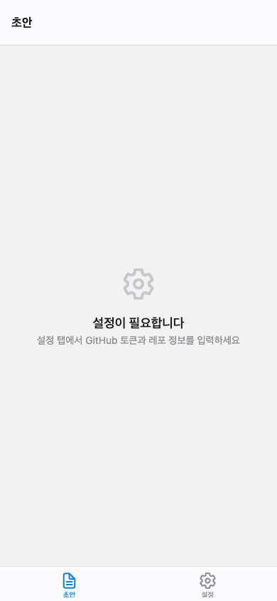
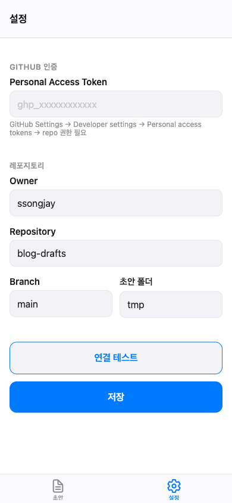

# Blog Draft

정제되지 않은 날 것의 생각들, 블로그 초안을 작성하기에 편하기 위해 만들었습니다.

GitHub 레포지토리에 마크다운 초안을 카테고리별로 정리하고, 핸드폰에서 바로 작성할 수 있는 모바일 앱입니다.

## 화면

| 초안 목록 | 설정 |
|:---------:|:----:|
|  |  |

## 주요 기능

- **초안 작성** — 카테고리 폴더 안에 마크다운 초안을 생성하고 편집합니다
- **마크다운 도구** — 볼드, 이탤릭, 헤더, 목록, 링크 등 서식 버튼으로 마크다운 문법을 몰라도 작성 가능
- **실시간 미리보기** — 편집/미리보기 탭을 전환하여 렌더링된 결과를 바로 확인
- **자동 커밋** — 저장 버튼을 누르면 GitHub REST API를 통해 자동으로 커밋+푸시
- **동기화** — Pull-to-refresh로 최신 상태를 가져옵니다
- **Private 레포** — 초안은 별도의 private 레포지토리에 저장되어 외부에 노출되지 않습니다

## 기술 스택

- React Native (Expo SDK 55)
- TypeScript
- GitHub REST API
- Expo Router (파일 기반 라우팅)
- Expo SecureStore (토큰 암호화 저장)

## 시작하기

```bash
# 의존성 설치
npm install

# 개발 서버 실행
npx expo start --ios
```

### 설정

1. GitHub에서 Personal Access Token 생성 (Fine-grained, Contents: Read and write)
2. 앱의 설정 탭에서 토큰과 레포 정보 입력
3. 연결 테스트 후 저장
